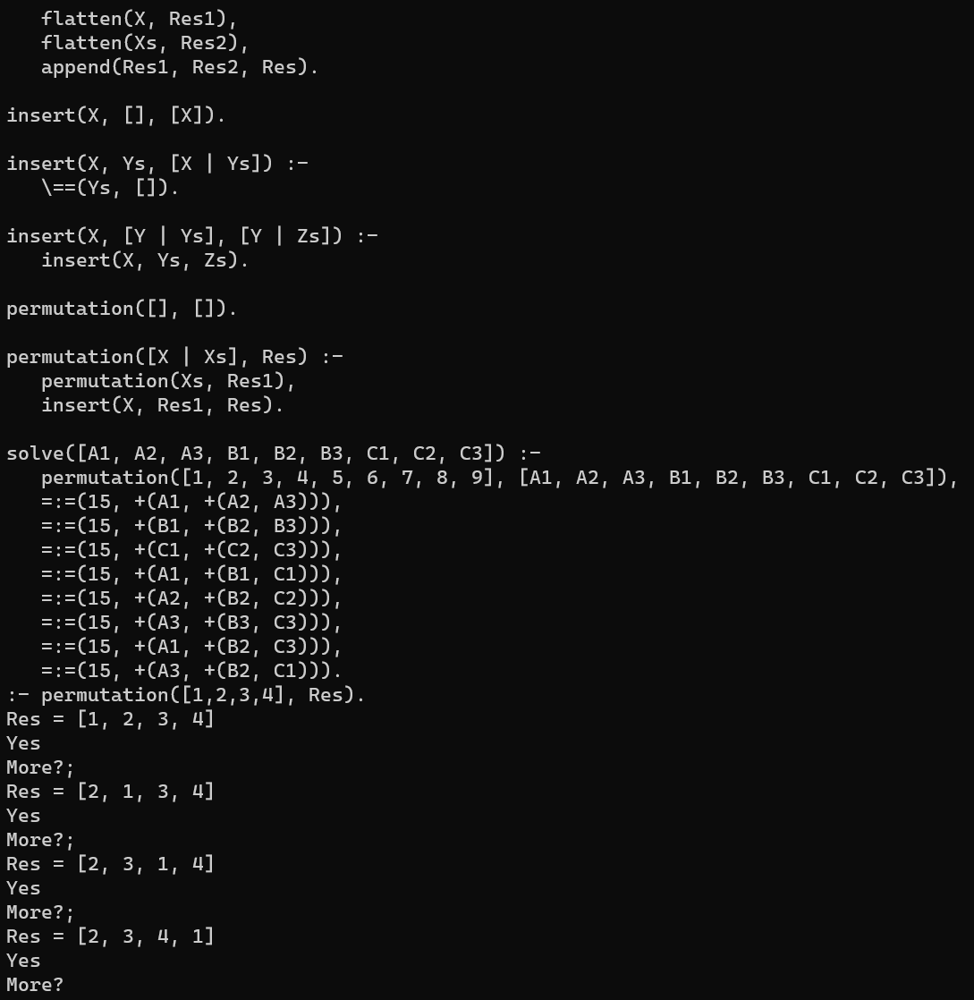

## Tree Walk Interpreter of a Subset of Prolog

To execute:

```bash
dune exec prolog examples/list.pl
```

It's better to use `rlwrap` to get persistent history and completion:

```bash
rlwrap dune exec prolog examples/list.pl
```

To get more answers type `;` and `enter`. If you don't want another answer type `enter`.

Our subset of Prolog is described by the following grammar :

```ebnf
Program   ::= ( Clause )+ 'eof'

Query     ::= Predicate ( ',' Predicate )* '.' 'eof'

Clause    ::= UserPredicate ( ':-' Predicate ( ',' Predicate )* )? '.'

Predicate ::= UserPredicate | BuiltinPredicate

UserPredicate    ::= Name '(' Term ( ',' Term )* ')'

BuiltinPredicate ::= ( '<=' | '>=' | '=' | '==' | '=:=' | '\=' | '\==' | '=\=' | 'is' ) '(' Term ',' Term ')'
                   | ( 'var' | 'not_var' | 'integer' | 'not_integer' ) '(' Term ')'


Term ::= Int | Variable | ( '+' | '-' | '*' | '/' ) '(' Term ',' Term ')'
       | Name ( '(' ( Term ( ',' Term )* )? ')' )?
       | List

List ::= '[' ( Term ( ',' Term )* ( '|' ( List | Variable ) )? )? ']'

Int  ::= [0-9]+

Name ::= [a-z][a-zA-Z0-9_]*

Variable ::= [A-Z_][a-zA-Z0-9_]*

Comment  ::= '/*' ( [^*] | '*'+ [^*/] )* '*'* '*/' | '%' [^\n]* '\n'
```


